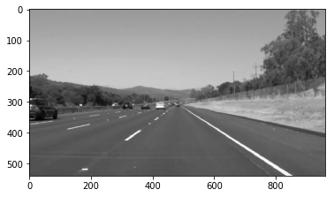
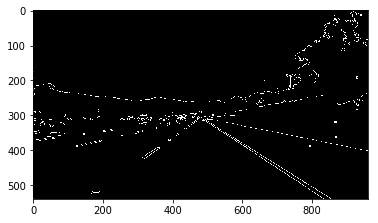
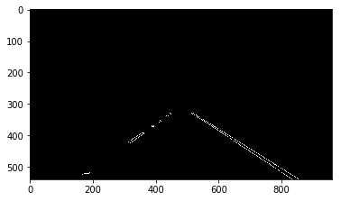
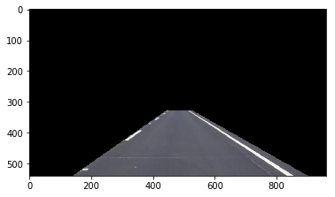
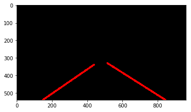
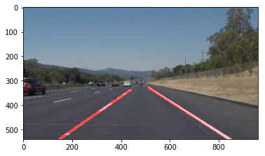

# **Finding Lane Lines on the Road**

**Finding Lane Lines on the Road**

The goals / steps of this project are the following:
* Make a pipeline that finds lane lines on the road
* Reflect on your work in a written report

[//]: # (Image References)

[image1]: ./examples/grayscale.jpg "Grayscale"

---

### Reflection

### 1. Describe your pipeline. As part of the description, explain how you modified the draw_lines() function.

My pipeline funtion (process_image) consists of 8 steps:

**Step1 :**  Grayscale the image

**Step2 :**  Apply Gaussian blur with kernel size 5

**Step3 :**  Apply Canny edge detection with a lower threshold of 75 and upper threshold of 200

**Step4 :**  Identify edges of the polygon for masking and determine the region of interest

**Step5 :**  Run hough Line transform on the masked edge detected image and segregate left lane and right lane lines from Hough transform

**Step6 :** Calling *finalLineSegment* for each lane individually to get a single line segment for both left and right lanes

> *finalLineSegment* does two things: 
> 
> **a.** Calculates the average slope from all the line segments (both left lane and right lane individually) and then using the average slope calculate the average y-intercept for all the line segments. Also taking care that if in any one of the frame there are no valid hough lines, the mean slope and mean y-intercept is taken from the last valid frame. \
> 
> **b.** Next it calculates the (x1,y1) and (x2,y2) 
>> y1 = Max Y pixel \
>> x1 = (y1- Avg(y-intercept)) / Avg(slope)\
>> y2 = Min of all the y-coordinate from one -side lane lines (left or right)\
>> x1 = (y1- Avg(y-intercept)) / Avg(slope)
>

**Step7 :**  draw lines using the above (x1,y1) and (x2,y2) with other pixels set to 0

**Step8 :**  Combine the original image with the above line image.

### 2. Identify potential shortcomings with your current pipeline

One potential shortcoming would be in the case where we have a crossing or a round-about or even a high curvatur road, then a single line for left and right will not solve problem.

Another shortcoming could be in the the if there are more than 1 lane line on the road like we have in the challenge.mp4 where rigth next to yellow line ther is a white line at some distance , so in that case the algorithm is not able to decide which line to be considered.

Also during lane change this algorithm won't work

### 3. Suggest possible improvements to your pipeline

A possible improvement would be to not considering one line on one side of the road but to have multiple lines, which can reduce the issues in the highly curved road.

Also changing the masked area dynamically would also help in the lane change scenerio and round-abouts scenerio .
